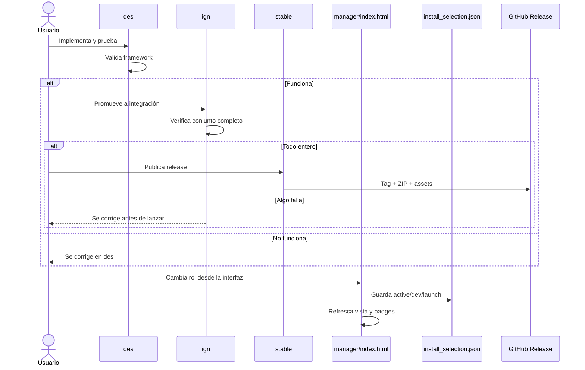
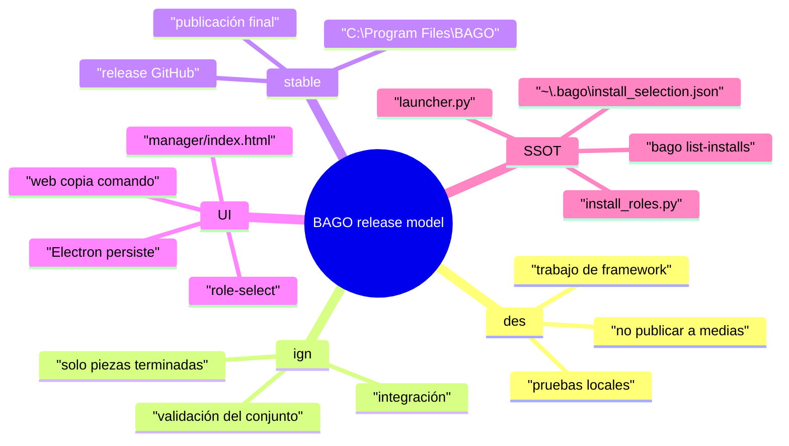
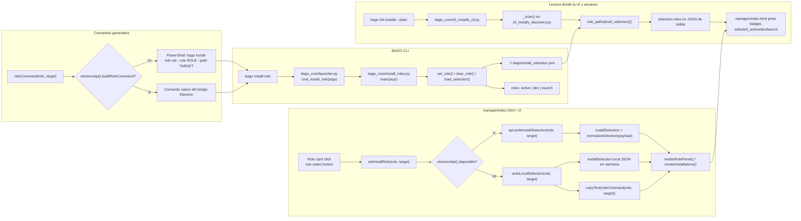
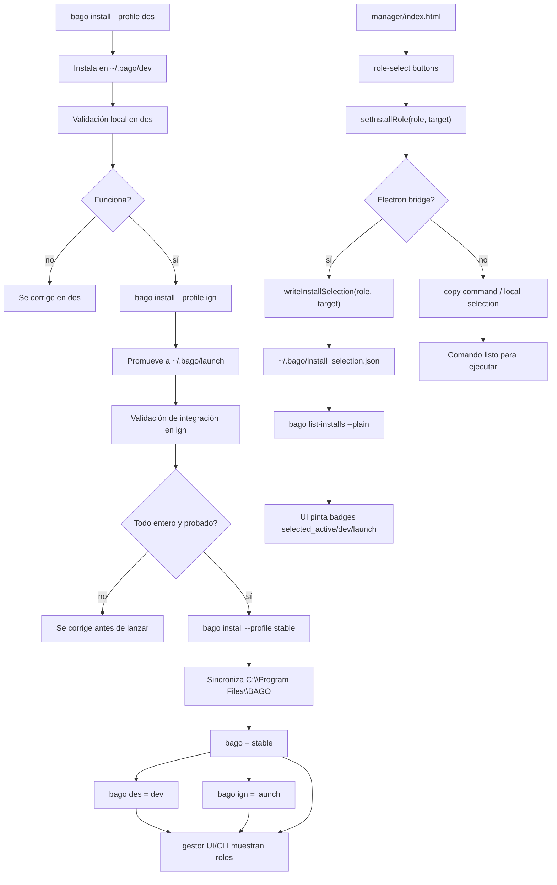

# BAGO 4.8.0 — Manual de Usuario

> **Session-First AI Chat**
> El contexto de sesión sobrevive al cambio de provider.
> El modelo es un motor temporal; la sesión es la fuente de verdad.

## Portada

| Campo | Valor |
|---|---|
| Producto | BAGO 4.8.0 |
| Tipo | Manual de usuario y guía de release |
| Alcance | `stable` / `des` / `ign` |
| UI | `manager/index.html` + capturas de CLI/UI |
| Validación | `validate`, `test_security_release.py`, `test_e2e.py`, `publish_release.py --test` |
| Artefactos | `dist\BAGO-Installation-Manager-4.8.0-win-x64.exe`, `dist\bago-v4.8.0.zip` |

### Contenido de esta edición

- Instalación y primer arranque.
- Flujo de chat, providers y sesión.
- Gestor de instalaciones con perfiles y promoción.
- Modo agente/headless con catálogo JSON de comandos.
- Manual de uso y notas de release.
- Anexo de diagramas consolidados.

---

## 1. Instalación y Primer Arranque

### Gobernanza de ramas (obligatoria)

Ramas base permitidas:

- `main` (fuente de verdad)
- `windows` (adaptación de plataforma)
- `android` (adaptación de plataforma)

Flujo obligatorio:

1. Trabajo común -> `main`.
2. Sincronización de plataforma -> PR de `main` hacia `windows` y `android`.
3. Prohibido reverse-merge de `windows`/`android` hacia `main`.

Blindajes de repositorio fuente:

- Los checks de PR viven bajo `.github/workflows/` en el repo fuente.
- Los hooks locales viven bajo `.githooks/` en el repo fuente.
- La activación de hooks y protección de ramas no forma parte del snapshot runtime.

Break-glass (emergencia):

1. Desactivar temporalmente protección de rama en GitHub.
2. Resolver hotfix.
3. Reaplicar protección con `scripts/apply_branch_protection.ps1`.

### Requisitos
- Python 3.11+
- Ollama (opcional, para provider local)
- API keys (opcionales, para providers cloud)

### Arranque

```bash
# Windows (CMD)
C:\Bago_v4> python bago_core\cli.py chat

# Windows (PowerShell)
PS C:\Bago_v4> python bago_core\cli.py chat

# Unix
$ ./bago.sh chat
```

### Banner de inicio

```
  ____    _    ____   ___
 | __ )  / \  / ___| / _ \
 |  _ \ / _ \ \___ \| | | |
 | |_) / ___ \ ___) | |_| |
 |____/_/   \_\____/ \___/
           v4.8.0 — Session-First AI Chat

Bienvenido a BAGO 4.8.0. Escribe /help para ver comandos.
El contexto de sesión sobrevive al cambio de provider.

────────────────────────────────────────────────────────────
● ollama-local/llama3.2:3b · 0 tok
────────────────────────────────────────────────────────────
bago ❯
```

> **Nota:** Si el modelo por defecto no está disponible en Ollama local, BAGO 4.8.0 **auto-ajusta** al primer modelo disponible automáticamente y te avisa.

### Nuevo gestor de instalaciones

BAGO 4.8.0 separa claramente los perfiles de instalación:

- `bago` -> copia estable activa
- `bago des` -> entorno de desarrollo completo del framework
- `bago ign` -> entorno de integración/lanzamiento

Flujo recomendado:

```bash
bago profiles
bago install --profile des
bago install --profile ign
bago install --profile stable
bago promote --from des --to ign
bago promote --from ign --to stable
```

Capturas del gestor:

- CLI: `docs/evidence/manual/captures/bago-profiles-cli.png`
- UI: `docs/evidence/manual/captures/bago-ui-index.png`

### Modo agente/headless

Todo comando slash visible en `/help` debe poder ejecutarse sin interfaz interactiva:

```bash
bago exec /help
bago exec /status
bago exec /commands json
bago exec /doctor
bago exec /switch ollama-local llama3.2:3b
```

Contratos:

- `/help` sale del mismo catálogo que el menú interactivo.
- `/commands json` exporta el mapa exacto para agentes y automatizaciones.
- `/doctor` verifica catálogo, modo headless, ruta base, roles de instalación y provider activo.
- Si un comando requiere datos, se pasa como argumentos en `bago exec /comando [args...]`.

## 12. Base de Conocimiento (partial/post-MVP)

- `/tools enable` activa tool-calling para providers que lo soporten
- `/memory hybrid-add <contenido>` guarda conocimiento + embedding acelerado
- `/memory hybrid-search <consulta>` busca por similitud vectorial

### Selección interactiva al inicio

Si el modelo por defecto no está disponible, o siempre que arranques el REPL, BAGO 4.8.0 te ofrece elegir provider y modelo de forma interactiva:

```
Provider actual: ollama-local/llama3.2:3b
Presiona Enter para continuar, o escribe 'cambiar' para elegir otro: cambiar

Providers configurados:
  1 ollama-local (5 modelos)
  2 openrouter (150+ modelos)
  0 Cancelar
Elige: 1

Modelos disponibles en ollama-local:
  1 llama3.2:3b
  2 mistral:7b
  ...
Elige: 2
✓ Conectado a ollama-local/mistral:7b
```

### Motor de Intenciones (Auto-Training)

BAGO 4.8.0 incluye un **motor de intenciones** que aprende automáticamente de tu estilo de conversación para decidir cuándo usar herramientas y cuándo no.

Intenciones detectadas:
- **chat** — saludos, conversación casual. BAGO **no ofrece herramientas** al modelo.
- **review** — "mira", "revisa", "reune". BAGO ofrece herramientas de lectura/listado.
- **execute** — "ejecuta", "corre", "lanza". BAGO ofrece herramientas de ejecución.
- **work** — "trabaja", "modulariza", "adapta", "crea". BAGO ofrece herramientas de modificación.

Regenerar el dataset manualmente:
```bash
/retrain_intents
```

BAGO también reentrena **automáticamente** justo antes de cada compactación de contexto, asegurando que siempre aprenda de tus últimas interacciones.

---

## 2. Comandos del REPL

| Comando | Descripción |
|---------|-------------|
| `/help` | Muestra esta ayuda |
| `/menu` | Abre un menú guiado con las funciones actuales |
| `/status` | Estado de la sesión activa |
| `/session` | Detalles de la sesión |
| `/models [provider]` | Lista modelos disponibles (del provider activo o especificado) |
| `/providers` | Lista providers registrados con estado de configuración |
| `/switch <provider> [modelo] [--force]` | Cambia de provider/modelo |
| `/save` | Guarda sesión en disco |
| `/load <session_id>` | Carga sesión desde disco |
| `/feedback <rating>` | Feedback explícito del usuario (-1.0 a 1.0) |
| `/suggest` | Sugerencia RL del mejor provider/modelo |
| `/good [índice]` | Marca mensaje como importante (no diluible) |
| `/config [list\|get\|set\|reset]` | Gestiona configuración del sistema |
| `/credentials [list\|set\|delete]` | Gestiona credenciales de providers |
| `/tools [list\|enable\|disable]` | Gestiona herramientas del modelo |
| `/allow` | Aprueba ejecución de herramientas pendientes |
| `/deny` | Rechaza ejecución de herramientas pendientes |
| `/plan <tarea>` | Genera un plan paso a paso |
| `/autopilot <tarea>` | Ejecuta tarea autónomamente paso a paso |
| `/agents` | Lista agentes especializados |
| `/agent <nombre>` | Activa un agente especializado |
| `/memory [list\|search\|add\|delete]` | Gestiona base de conocimiento persistente |
| `/quit` | Salir del chat |

### Servidor API (`bago serve`)

BAGO 4.8.0 expone una API HTTP para integraciones externas:

```bash
C:\Bago_v4> python bago_core\cli.py serve --port 8080 --token secret123
[API] Servidor iniciado en http://0.0.0.0:8080
[API] Token requerido: secr***
```

Endpoints:
- `GET /status` → Estado de la sesión
- `GET /session` → Sesión activa, provider/modelo y modo de catálogo
- `GET /history` → Historial persistido de la sesión activa
- `POST /chat` → `{message: "hola"}` → Respuesta del modelo
- `POST /command` → `{command: "/status"}` → Ejecuta el mismo backend de slash commands del REPL y devuelve `message` + `data/plan` cuando aplica
- `GET /providers` → Lista providers disponibles
- `GET /models/<provider>` → Lista modelos del provider
- `POST /switch` → `{provider: "...", model: "...", force: false}`
- `GET /catalog/status` y `POST /catalog/config` → Modo `all` o `available-only`
- `GET /simulation/status`, `GET /simulation/events` y `POST /simulation/config` → Estado y trazas del shadow loop

Cabeceras útiles:

- `X-Bago-Token` → token si la API está protegida
- `X-Bago-Channel` → canal lógico de origen (`terminal`, `desktop`, `api`)

### UI React dual

La carpeta `ui-react\` contiene una capa visual React con dos superficies:

- **Terminal**: estilo shell/chat
- **Escritorio**: panel visual con el mismo control

Las dos usan la misma sesión backend y el mismo bus de control HTTP, así que cambiar de vista no cambia de autoridad ni rompe el contexto.

Arranque local:

```bash
# Terminal 1
python bago_core\cli.py serve --port 8080

# Terminal 2
cd ui-react
npm install
npm run dev
```

Arranque integrado con bundle compilado:

```bash
python bago_core\cli.py serve --port 8080
```

Si `ui-react\dist` existe, `serve` la expone automáticamente. También puedes forzar otra ruta:

```bash
python bago_core\cli.py serve --port 8080 --ui-dist C:\ruta\dist
```

Build:

```bash
cd ui-react
npm run build
```

Simulación segura (`shadow`):

- registra acciones reales sin tomar control autónomo;
- guarda estado en `.bago\state\ui_control_shadow.json`;
- guarda eventos en `.bago\logs\ui_control_shadow.jsonl`;
- expone `authority = observer-only` para dejar claro que no hay override autónomo;
- conserva `canary` y `full` como puertas futuras, pero hoy siguen siendo observación segura como `shadow`.

### Generador de evidencias (`bago evidence`)

BAGO 4.8.0 puede materializar un bundle de evidencia contractual para demostrar ayuda directa e indirecta al usuario.

```bash
C:\Bago_v4> python bago_core\cli.py evidence --mode simulated --objective community-knowledge --output docs\evidence\example_bundle --overwrite
✓ Bundle generado: C:\Bago_v4\docs\evidence\example_bundle\manifest.json
```

Comandos clave:

```bash
# Validar el generador
python bago_core\cli.py evidence --test

# Generar evidencia simulada (sin provider externo)
python bago_core\cli.py evidence --mode simulated --objective community-knowledge --output docs\evidence\example_bundle --overwrite

# Generar evidencia real con provider vivo
python bago_core\cli.py evidence --mode real --provider ollama-local --model "llama3.2:3b" --output C:\temp\bago_real_bundle
```

Contratos relacionados:

- `docs\COMMUNITY.md`
- `docs\contracts\README.md`
- `docs\contracts\bago_v4_runtime_contract.json`
- `docs\contracts\bago_v4_repl_contract.md`
- `docs\contracts\bago_v4_evidence_contract.md`
- `docs\contracts\bago_v4_knowledge_contract.md`

### Captura: `/help`

```
bago ❯ /help
Comandos disponibles:
  /switch <provider> [modelo] [--force]   Cambia de provider/modelo
  /models [provider]                       Lista modelos disponibles
  /status                                  Estado de la sesión activa
  /session                                 Detalles de la sesión
  /save                                    Guarda sesión en disco
  /load <session_id>                       Carga sesión desde disco
  /providers                               Lista providers registrados
  /feedback <rating>                       Feedback explícito (-1 a 1)
  /suggest                                 Sugerencia RL de provider
  /good [índice]                           Marca mensaje como importante
  /config [list|get|set|reset]             Gestiona configuración
  /credentials [list|set|delete]           Gestiona credenciales API
  /tools [list|enable|disable]             Gestiona herramientas
  /allow                                   Aprueba ejecución de herramientas
  /deny                                    Rechaza ejecución de herramientas
  /plan <tarea>                           Genera plan paso a paso
  /autopilot <tarea>                       Ejecuta tarea autónomamente
  /agents                                  Lista agentes especializados
  /agent <nombre>                          Activa un agente especializado
  /memory [list|search|add|delete]           Gestiona base de conocimiento
  /help                                    Muestra esta ayuda
  /quit                                    Salir del chat
────────────────────────────────────────────────────────────
● ollama-local/llama3.2:3b · 0 tok
────────────────────────────────────────────────────────────
```

---

## 3. Estados de Sesión

### `/status` — Estado en tiempo real

```
bago ❯ /status
Session ID : 97a91109-878
Provider   : ollama-local
Model      : llama3.2:3b
Health     : OK — Ollama OK (5 models)
Messages   : 0
Tokens     : 0
Calls      : 0
Switches   : 0
────────────────────────────────────────────────────────────
● ollama-local/llama3.2:3b · 0 tok
────────────────────────────────────────────────────────────
```

### `/providers` — Providers registrados

Ejecuta `python bago_core\cli.py validate` para ver el estado de todos los providers:

```
[✓] ollama-local    — Ollama OK (5 models)
[✗] ollama-cloud    — No URL configured
[✗] copilot         — No token configured
[✗] anthropic       — No API key
[✗] codex           — No API key
[✗] openrouter      — No API key
[✗] opencode        — No API key
```

> Los providers cloud requieren variables de entorno:
> - `OLLAMA_CLOUD_URL` / `OLLAMA_CLOUD_KEY`
> - `GITHUB_TOKEN` (Copilot)
> - `ANTHROPIC_API_KEY`
> - `OPENAI_API_KEY`
> - `OPENROUTER_API_KEY`
> - `OPENCODE_API_KEY`

---

## 4. Chat Multi-Provider

### Enviar un mensaje

Simplemente escribe tu mensaje y pulsa `Enter`:

```
bago ❯ Hola BAGO, confirma funcionamiento con OK
You Hola BAGO, confirma funcionamiento con OK
BAGO ¡Hola! OK, confirmando funcionamiento... ESTOY ACTIVO. ¿En qué puedo ayudarte hoy?
────────────────────────────────────────────────────────────
● ollama-local/llama3.2:3b · 61 tok
────────────────────────────────────────────────────────────
```

### Multilínea

Usa tres backticks para enviar mensajes de varias líneas:

```
bago ❯ ```
... escribe
... varias
... líneas
... ```
```

---

## 5. Switch de Provider/Modelo

BAGO 4.8.0 permite cambiar de modelo **sin perder la sesión**. El sistema evalúa la equivalencia entre modelos y aplica la estrategia de transferencia adecuada.

### Switch básico

```
bago ❯ /switch ollama-local llama3.2:1b --force
Switch completado: ollama-local/llama3.2:3b → ollama-local/llama3.2:1b
✓ Switch: ollama-local/llama3.2:3b → ollama-local/llama3.2:1b
  ⚠ Se aplicará estrategia de contexto: RESET
────────────────────────────────────────────────────────────
● ollama-local/llama3.2:1b · 61 tok
────────────────────────────────────────────────────────────
```

### Niveles de equivalencia

| Tier | Modelos | Estrategia |
|------|---------|------------|
| Tier 1 (Frontier) | gpt-4o, claude-sonnet-4, qwen2.5:14b | DIRECT |
| Tier 2 (Everyday) | gpt-4o-mini, llama3.2, gemini-flash | DIRECT |
| Tier 3 (Fast) | phi4, deepseek-r1:8b | COMPRESS |
| Tier 4 (Ultra-light) | smollm2, tinyllama | REHYDRATE / RESET |

Si el switch no es recomendado, el sistema te avisará. Usa `--force` para forzar.

### Compresión por capas (downgrade)

Cuando cambias a un modelo menor, BAGO 4.8.0 **no pierde el contexto**: lo comprime por capas jerárquicamente:

- **Capa 1** → se resume en un bloque A
- **Capa 2** → se resume + se une con A → bloque unificado B
- **Capa 3** → se resume + se une con B → bloque C
- Y así sucesivamente...

La idea principal se diluye progresivamente, a menos que la marques como **importante**.

### Marcar mensajes como "good" (no diluibles)

```
bago ❯ /good
Mensaje -1 marcado como 'good' — no se diluirá en compresión.
```

Los mensajes marcados como `good` sobreviven a la compresión sin resumirse. Úsalos para:
- Instrucciones críticas del system prompt
- Preguntas clave que no quieres que se diluyan
- Respuestas fundamentales que definen la conversación

### Ejemplo de compresión

Historial original (3 capas):
```
[USER] Explica relatividad general en profundidad...
[ASSISTANT] La relatividad general de Einstein establece...
[USER-GOOD] ¿Y qué pasa con los agujeros negros?
[ASSISTANT] Los agujeros negros son regiones donde...
```

Después de compresión:
```
[ASSISTANT] [USER] Explica relatividad... || PREV: [SYS-instrucción base]
[ASSISTANT] [USER] ¿Y qué pasa con los agujeros negros? ... || PREV: [capa 1 resumida]
[PRESERVED USER]: ¿Y qué pasa con los agujeros negros?
```

Los datos de capas se persisten en:
```
.bago/state/layers/<session_id>_layers.jsonl
```

---

## 6. Configuración y Credenciales

BAGO 4.8.0 gestiona su configuración en `.bago/config.json` y las credenciales en `.bago/credentials.json`. Ya no dependes exclusivamente de variables de entorno.

### Desde la línea de comandos

```bash
# Ver configuración completa
C:\Bago_v4> python bago_core\cli.py config list

# Cambiar provider por defecto
C:\Bago_v4> python bago_core\cli.py config set default_provider openrouter

# Activar un provider
C:\Bago_v4> python bago_core\cli.py config set providers.openrouter.enabled true

# Restaurar defaults
C:\Bago_v4> python bago_core\cli.py config reset
```

### Desde el REPL

```
bago ❯ /config list
Configuración:
default_provider : ollama-local
default_model    : llama3.2:3b
temperature      : 0.7
streaming        : True
compression      : True
rl_learning      : True

bago ❯ /config set temperature 0.5
✓ temperature = 0.5

bago ❯ /credentials set anthropic ANTHROPIC_API_KEY sk-ant-xxx
✓ Credencial guardada para anthropic/ANTHROPIC_API_KEY

bago ❯ /credentials list
  anthropic/ANTHROPIC_API_KEY: sk-a***
```

> **Seguridad:** Las credenciales se almacenan en `.bago/credentials.json` con permisos restrictivos (`0o600`).

---

## 7. Persistencia de Sesión

### Guardar manualmente

```
bago ❯ /save
Sesión guardada: 97a91109-878
```

### Guardado automático

Al salir con `/quit`, la sesión se guarda automáticamente:

```
bago ❯ /quit
Bye.
Sesión guardada automáticamente: 97a91109-878
```

### Cargar una sesión

```
bago ❯ /load 97a91109-878
Sesión cargada: 97a91109-878
```

Los archivos de sesión se almacenan en:
```
.bago/state/sessions/<session_id>.json
```

---

## 8. Aprendizaje por Refuerzo (RL experimental)

BAGO 4.8.0 incluye un motor de RL ligero que aprende de cada interacción. En el producto estable se mantiene como `shadow/off` por defecto y no tiene autoridad de ejecución:

- **Recompensa implícita**: se calcula automáticamente por rapidez, longitud de respuesta y ausencia de errores.
- **Recompensa explícita**: el usuario puede valorar cualquier respuesta con `/feedback <rating>`.
- **Sugerencia inteligente**: `/suggest` recomienda el provider/modelo con mejor historial.

### Feedback explícito

```
bago ❯ /feedback 1
Feedback registrado: 1.0
```

Valores válidos: `-1.0` (muy malo) a `1.0` (muy bueno).

### Sugerencia RL

```
bago ❯ /suggest
Sugerencia RL: ollama-local/llama3.2:3b (score=0.00)
```

A medida que uses el sistema, el score se ajustará y las sugerencias mejorarán.

### Arquitectura RL

```
┌─────────────────────────────────────────┐
│         FeedbackCollector               │
│   implicit() + explicit() → RewardStore │
├─────────────────────────────────────────┤
│         PreferenceModel                 │
│   score(provider, model, fingerprint)   │
├─────────────────────────────────────────┤
│         RLPolicy (ε-greedy + UCB1)      │
│   select(candidates) → best pair        │
└─────────────────────────────────────────┘
```

Los datos RL se persisten en:
```
.bago/state/rl/rewards.jsonl
```

---

## 9. Plan y Autopilot (experimental/post-MVP)

BAGO 4.8.0 puede generar planes de tareas y preparar ejecución asistida. Esta superficie es experimental y no forma parte del MVP estable hasta que tenga pruebas por escenario, permisos explícitos y evidencia.

### `/plan` — Generar plan paso a paso

```
bago ❯ /plan Crea un script Python que lea un CSV y genere un reporte
📋 Plan: Crea un script Python que lea un CSV y genere un reporte

  ○ 1. Crear archivo read_csv.py con funciones de lectura
  ○ 2. Crear función generate_report() que procese datos
  ○ 3. Escribir tests básicos
  ○ 4. Ejecutar script y verificar salida
```

### `/autopilot` — Ejecutar tarea autónomamente

```
bago ❯ /autopilot Crea un script Python que lea un CSV y genere un reporte
📋 Plan generado (4 pasos):
  ○ 1. Crear archivo read_csv.py...
  ○ 2. Crear función generate_report()...
  ○ 3. Escribir tests básicos...
  ○ 4. Ejecutar script y verificar salida...

🚀 Ejecutando...
  ✓ Paso 1: Crear archivo read_csv.py...
    → Archivo escrito: read_csv.py (245 chars)...
  ✓ Paso 2: Crear función generate_report()...
    → Función añadida con formato HTML...
  ✓ Paso 3: Escribir tests básicos...
    → Tests escritos en test_read_csv.py...
  ✓ Paso 4: Ejecutar script y verificar salida...
    → report.html generado correctamente.
```

En modo **autopilot**, BAGO:
1. Genera un plan con el modelo activo
2. Ejecuta cada paso enviándolo al modelo
3. El modelo puede usar **herramientas** (`read_file`, `write_file`, `execute_command`) en cada paso
4. Muestra el progreso paso a paso

> **Nota:** Autopilot delega a `send()` (no streaming) para permitir tool calling en cada paso.

---

## 10. Allow All — Control de Ejecución de Herramientas

BAGO 4.8.0 puede ejecutar herramientas automáticamente o pedirte confirmación antes de hacerlo, al estilo **Copilot Allow All**.

Regla estable: la sugerencia y la ejecución están separadas. `auto_allow_tools` debe permanecer en `false` por defecto y cualquier ejecución crítica debe pasar por aprobación explícita.

### Comportamiento por defecto

Por defecto, `auto_allow_tools = False`: BAGO pide confirmación antes de ejecutar herramientas.

### Permitir ejecución automática

```
bago ❯ /config set features.auto_allow_tools true
✓ features.auto_allow_tools = True
```

Si mantienes el valor por defecto, cuando el modelo pida usar una herramienta, BAGO pausará y mostrará:

```
⏸️ El modelo quiere usar estas herramientas:
  • read_file: {"path": "main.py"}
  • execute_command: {"command": "python main.py"}

Escribe /allow para ejecutarlas o /deny para rechazarlas.
```

### Aprobar o rechazar

```
bago ❯ /allow
BAGO [resultado de las herramientas + respuesta final]
```

```
bago ❯ /deny
Herramientas rechazadas.
```

### Desde la línea de comandos

```bash
C:\Bago_v4> python bago_core\cli.py config set features.auto_allow_tools true
```

---

## 11. Arranque LLM provider-aware

BAGO v4 puede separar providers instalados/configurados de providers disponibles para configurar:

```bash
C:\Bago_v4> python bago_core\cli.py llm list
```

Para iniciar una sesión con un provider concreto:

```bash
C:\Bago_v4> python bago_core\cli.py llm start --provider ollama-local
```

Para validar la selección sin abrir el chat:

```bash
C:\Bago_v4> python bago_core\cli.py llm start --provider ollama-local --model llama3.2:3b --dry-run
```

La selección queda registrada en `.bago/state/llm_start.json` y se usa para esa sesión de arranque.

---

## 12. Base de Conocimiento (partial/post-MVP)

BAGO 4.8.0 incluye una **base de conocimiento persistente** que sobrevive a las sesiones. Almacena recuerdos, hechos y notas importantes extraídos de las conversaciones.

Estado actual: superficie parcial. La sesión persistente entra en el MVP; memoria avanzada, embeddings e inyección automática de recuerdos quedan fuera del MVP hasta tener prueba end-to-end.

### Almacenamiento

Los datos se guardan en SQLite (sin dependencias externas):

```
.bago/state/knowledge.db
```

### Comandos

```
bago ❯ /memory add Python fue creado por Guido van Rossum
✓ Recuerdo añadido (ID: 1).

bago ❯ /memory search Python
Resultados para 'Python':
  • Python fue creado por Guido van Rossum... (sesión: 97a91109-878)

bago ❯ /memory list
Recuerdos recientes (1):
    1 | 2026-05-29T18:30:00 | Python fue creado por Guido van Rossum...

bago ❯ /memory delete 1
✓ Recuerdo 1 eliminado.
```

### Desde el código

```python
from knowledge_base import KnowledgeBase

kb = KnowledgeBase(base_path="C:\\Bago_v4")
kb.add("El usuario prefiere respuestas en español.", source_session="sess-1")
results = kb.search("español")
```

### Integración automática

En el futuro, la Knowledge Base se puede conectar al `send()` para inyectar recuerdos relevantes en el system prompt antes de cada interacción, dando al modelo contexto de largo plazo.

---

## 12. Arquitectura de BAGO 4.8.0

```
┌─────────────────────────────────────────┐
│           Chat Interface (REPL)        │
│     renderer.py | commands.py | repl.py│
├─────────────────────────────────────────┤
│         Session Manager                 │
│   context_store + equiv_map + adapters│
│   + rl_engine + context_compressor    │
│   + plan_engine + agent_gateway         │
├─────────────────────────────────────────┤
│      Tool Registry | Knowledge Base     │
│   read_file | write_file | execute_cmd │
│   search_memory | add_memory            │
├─────────────────────────────────────────┤
│         Switch Engine                   │
│   validate → verdict → strategy → exec  │
├─────────────────────────────────────────┤
│      Provider Adapters (7)              │
│  ollama-local | ollama-cloud | copilot  │
│  anthropic | codex | openrouter         │
│  opencode                               │
├─────────────────────────────────────────┤
│      API Bridge (HTTP REST)            │
│   status | chat | providers | models    │
├─────────────────────────────────────────┤
│      Context Store (JSON Lines)         │
│  context.jsonl | timeline.jsonl         │
│  tokens.json | meta.json                │
├─────────────────────────────────────────┤
│      Layer Store (JSON Lines)           │
│  <session_id>_layers.jsonl             │
├─────────────────────────────────────────┤
│      Knowledge Base (SQLite)           │
│  knowledge.db | memories | memories_fts│
├─────────────────────────────────────────┤
│      RL Store (JSON Lines)              │
│  rewards.jsonl                          │
└─────────────────────────────────────────┘
```

### Principios

1. **Sesión = Fuente de verdad** — El contexto sobrevive al cambio de provider.
2. **Modelo = Motor temporal** — El provider es intercambiable; la sesión persiste.
3. **Seguro por defecto** — Herramientas, API externa, RL y automatización requieren permisos o flags explícitos.
4. **Auto-ajuste controlado** — Si un modelo no está disponible, se elige automáticamente el primero disponible y se informa al usuario.

---

## 13. Gestor de Instalaciones

### Subtítulo

> `des` para construir el framework, `ign` para validar el conjunto, `stable` para publicar entero.

### Flujo general

```mermaid
flowchart LR
  subgraph Source["Fuente / Workspace"]
    A["Repo BAGO<br/>C:\\Users\\AMTEC_Terminal_1º\\source\\repos\\BAGO"]
    B["Estado de selección<br/>~\\.bago\\install_selection.json"]
    C["Capturas manual<br/>docs\\evidence\\manual\\captures"]
  end

  subgraph Dev["Desarrollo"]
    D["bago install --profile des"]
    E["Copia dev<br/>~\\.bago\\dev"]
    F["Pruebas locales"]
    G["Correcciones en el framework"]
  end

  subgraph Ignite["Integración"]
    H["bago install --profile ign"]
    I["Copia launch<br/>~\\.bago\\launch"]
    J["Validación de conjunto"]
    K["Promoción solo de piezas cerradas"]
  end

  subgraph Stable["Publicación"]
    L["bago install --profile stable"]
    M["Copia estable<br/>C:\\Program Files\\BAGO"]
    N["Release ZIP + tag + GitHub Release"]
    O["bago = stable"]
  end

  subgraph UI["Interfaz de gestión"]
    P["manager/index.html"]
    Q["Role cards<br/>active / dev / launch"]
    R["setInstallRole(role, target)"]
    S{"Electron bridge disponible?"}
    T["writeInstallSelection(role, target)"]
    U["Copiar comando manual"]
    V["bago install-role set ..."]
    W["bago list-installs --plain"]
    X["Render de badges y rutas"]
  end

  A --> D
  D --> E
  E --> F
  F --> G
  G --> H
  H --> I
  I --> J
  J --> K
  K --> L
  L --> M
  M --> N
  N --> O

  P --> Q --> R --> S
  S -- "sí" --> T --> B
  S -- "no" --> U --> V --> B
  B --> W --> X --> Q

  C --> P
  M --> W
  E --> W
  I --> W
```



### Secuencia operativa



### Mapa mental


### Notas de uso

- En la UI de Electron, los botones de rol persisten la selección en `~\.bago\install_selection.json`.
- En la web pura, la UI copia el comando para ejecutarlo manualmente.
- La vista `Releases` crea trabajos verificados; no instala directamente desde una URL.
- La vista `Trabajos` muestra descarga, progreso, cancelación, reanudación, SHA256, logs, instalación y rollback.
- Los trabajos persisten bajo `~\.bago\manager\release-jobs\`.
- Un bundle solo queda listo cuando coinciden su checksum emparejado, el digest GitHub publicado y la compatibilidad mínima.
- Antes de modificar un destino existente, el gestor crea un backup atómico en el mismo volumen.
- `bago install --profile des` instala la copia de desarrollo.
- `bago install --profile ign` promueve y valida la integración.
- `bago install --profile stable` sincroniza la instalación estable en `C:\Program Files\BAGO`.
- `bago profiles` muestra el mapa y el flujo recomendado.

---

## 14. Providers Soportados

| Provider | Tipo | Auth | Estado |
|----------|------|------|--------|
| **ollama-local** | Local | Ninguna | ✅ Listo |
| **ollama-cloud** | Cloud | URL + Key opcional | ⚙️ Configurable |
| **copilot** | Cloud | GitHub Token | ⚙️ Configurable |
| **anthropic** | Cloud | API Key | ⚙️ Configurable |
| **codex** | Cloud | API Key | ⚙️ Configurable |
| **openrouter** | Cloud | API Key | ⚙️ Configurable |
| **opencode** | Cloud | API Key | ⚙️ Configurable |

---

## 15. Solución de Problemas

### Error 404 / Modelo no encontrado

```
BAGO Error Ollama: HTTP Error 404: Not Found
```

**Causa:** El modelo por defecto no está descargado en Ollama.

**Solución:** BAGO 4.8.0 auto-ajusta al primer modelo disponible. Si aun así falla, descarga un modelo:

```bash
ollama pull llama3.2:3b
```

### Timeout

```
BAGO Error Ollama: timed out
```

**Causa:** El modelo es muy lento o el sistema está sobrecargado.

**Solución:** Cambia a un modelo más rápido:

```
/switch ollama-local llama3.2:3b --force
```

### Provider no configurado

```
[✗] anthropic — No API key
```

**Solución (vía entorno):** Exporta la variable de entorno correspondiente:

```bash
set ANTHROPIC_API_KEY=tu-key-aqui
```

**Solución (vía Credential Manager):** Desde el REPL:

```
bago ❯ /credentials set anthropic ANTHROPIC_API_KEY sk-ant-xxx
```

O desde línea de comandos:

```bash
python bago_core\cli.py config set providers.anthropic.enabled true
```

> **Tip:** Al iniciar el REPL, BAGO 4.8.0 te ofrece una selección interactiva de providers y modelos disponibles.

---

## 16. Atajos y Tips

| Atajo | Descripción |
|-------|-------------|
| `↑` / `↓` | Navegar historial de comandos (readline) |
| `Ctrl+C` | Cancelar entrada actual |
| `Ctrl+D` | Salir del REPL (equivalente a `/quit`) |
| ```triple backticks``` | Modo multilínea |

---

**BAGO 4.8.0** — Session-First AI Chat
*Construido con arquitectura atómica, sin gates, con memoria compartida.*

---

## 17. Anexo de Diagramas Consolidados

Los diagramas de este anexo recogen la versión final consolidada de los flujos que se fueron refinando durante la conversación.

### 17.1 Gestión de roles desde la interfaz y el CLI



### 17.2 Flujo des -> ign -> stable



### 17.3 Secuencia de roles y publicación


### 17.4 Mapa mental del release model


